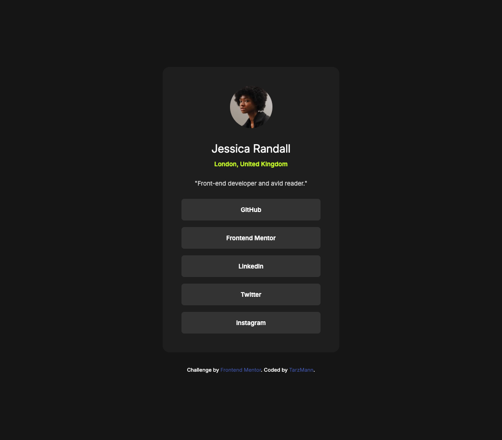

# Frontend Mentor - Social links profile solution

This is a solution to the [Social links profile challenge on Frontend Mentor](https://www.frontendmentor.io/challenges/social-links-profile-UG32l9m6dQ). Frontend Mentor challenges help you improve your coding skills by building realistic projects. 

## Table of contents

- [Overview](#overview)
  - [The challenge](#the-challenge)
  - [Screenshot](#screenshot)
  - [Links](#links)
- [My process](#my-process)
  - [Built with](#built-with)
  - [What I learned](#what-i-learned)
  - [Continued development](#continued-development)
  - [Useful resources](#useful-resources)
- [Author](#author)

## Overview

### The challenge

Users should be able to:

- See hover and focus states for all interactive elements on the page

### Screenshot



### Links

- Solution URL: [Solution on GitHub](https://github.com/TarzMann/social-links-profile)
- Live Site URL: [Live site](https://tarzmann.github.io/social-links-profile/)

## My process

### Built with

- Semantic HTML5 markup
- CSS custom properties
- Flexbox
- Mobile-first workflow

### What I learned

The hardest part of this exercise for me was all about using the Flexbox to centre the social links card. I hit a hurdle where the width of the container was not expanding to the max-width I had set. I realised that the combination of HTML and CSS I had used to separate out the attribution was causing the max-width to be ignored (maybe because of flex-childrens default display mode?). I finally figured out that I needed an additional div wrapper where the width and max-width had to be separated out. Example below:

```html
<body>
    <div class="wrapper">
      <div class="container">
      </div>
  </div>
</body>
```
```css
body {
    background-color: hsl(0, 0%, 8%);
    color: hsl(0, 0%, 100%);
    padding: 15px;
    height: 100vh;
    margin: auto;
    box-sizing: border-box;
    display: flex;
    justify-content: center;
    align-items: center;
}

.wrapper {
    width: 100%;
    max-width: 375px;
}

.container {
    background-color: hsl(0, 0%, 12%);
    padding: 30px;
    border-radius: 15px;  
    text-align: center;
    transition-duration: 0.4s;
}
```

### Continued development

I'd like to keep developing my knowledge of Flexbox vs Grid. And specifically what child elements inherit or don't inherit. I'd also like to focus on streamlining my CSS. I think I do add more in that I possibly need to. And of course general responsiveness.

### Useful resources

- [Always W3Schools!](https://www.w3schools.com/)

## Author

- GitHub - [TarzMann](https://github.com/TarzMann)
- Frontend Mentor - [@TarzMann](https://www.frontendmentor.io/profile/TarzMann)
